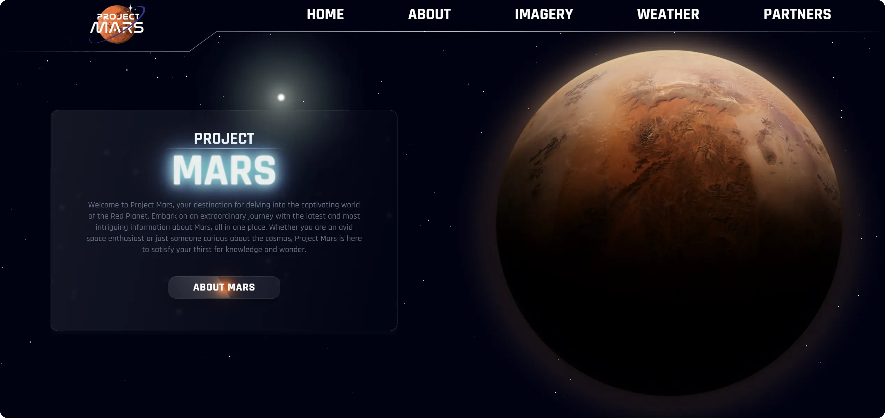
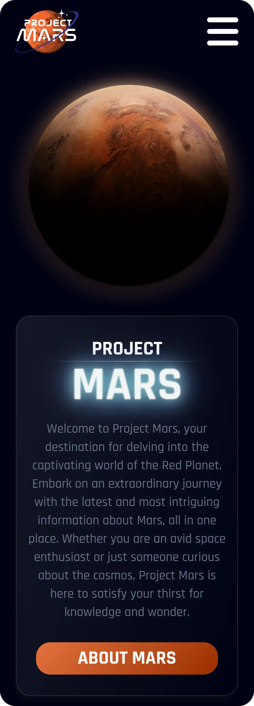
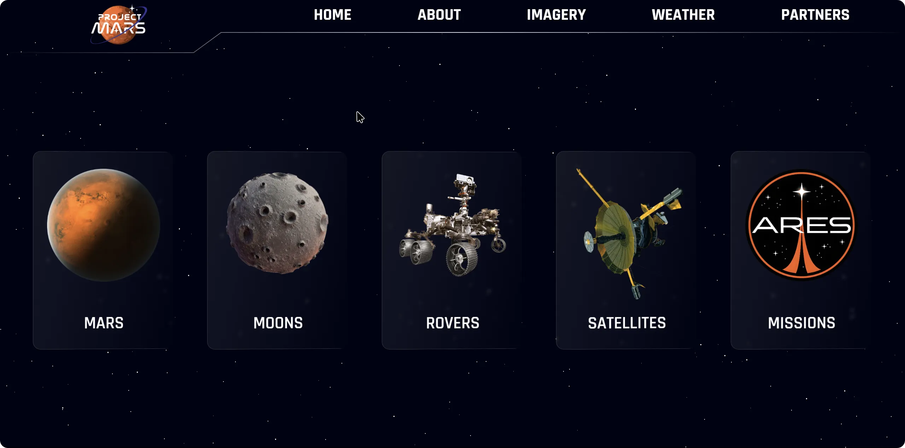
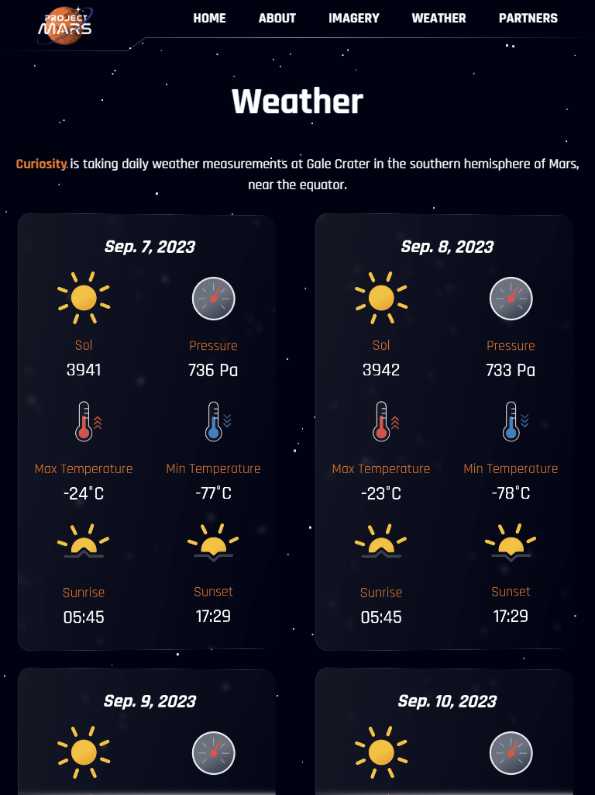

<h1 align="center">Project Mars</h1>

Project Mars is a frontend web application that provides a captivating journey through the Martian landscape. As a frontend developer, I've used various technologies and techniques to create an engaging and informative experience for users interested in the Red Planet.

<h2>Project Structure</h2>
The project is structured to ensure clarity and maintainability. <b>It contains two branches for data scraping:</b>

- **`server`:**
 Features a traditional client-server architecture where the server serves the scraped data to the frontend.

- **`serverless`:**
Utilizes a serverless function on Vercel, making data retrieval more efficient.

<h2>Technologies Used</h2>

<h3>Frontend</h3>

- **React:** The frontend of Project Mars is built with React, providing a dynamic and responsive user interface.
- **React Router:** For client-side routing, enabling seamless navigation within the application.
- **Recharts:** Utilized for creating interactive charts and visualizations.
- **Three.js:** To incorporate 3D models and enhance the user experience.
- **Vite:** As a fast build tool for the frontend development stack.
  

<h3>Data Scraping</h3>

- **Puppeteer:** Used to scrape data from NASA's site and generate API endpoints for the frontend.
- **Node.js**: Used for backend operations in the classic client-server scheme.
- **Serverless Function (Vercel):** The serverless architecture on Vercel efficiently serves scraped data to the frontend.

<h3>Design and Styling</h3>

- **Tailwind CSS:** Employed for styling, ensuring a modern and visually appealing design.
- **Figma/Adobe Illustrator:** Custom-created and/or edited assets and illustrations to enhance the project's aesthetics.
- **Draco3D:** Used for compressing 3D models to improve loading times.

<h3>Optimization</h3>

- **Asset Compression:** All assets, including 3D models, are compressed for optimal network efficiency.
- **Text Compression (gzip):** Text-based content is compressed to reduce load times and improve performance.
- **React Context:** Used for managing and sharing state data across component tree without having to pass props manually at every level of nesting (prop drilling).
- **`node-cache`:**  Used for caching data for 24 hours in the  **`server`** to minimize redundant data fetching.
- **`localStorage`:** Utilized to store weather data for 24 hours in the **`serverless`** function to enhance network efficiency.

<h3>Performance Metrics</h3>
The project's performance has been optimized using data from <b><i>Lighthouse</i></b> and <b><i>WebVitals</i></b>, obtaining excellent results.

<h2>Usage</h2>

1. Clone the repository:<b> `git clone https://github.com/cristianvsirbu/project-mars`</b>
2. Navigate to the project directory:<b> `cd project-mars`</b>
3. Install the dependencies:<b> `npm install`</b>
4. Start the development server:<b> `npm run dev`</b>
5. Open the application in your browser:<b> `http://localhost:3000`</b>

<h2>Contribution</h2>

Contributions are welcome! If you encounter any issues or have suggestions for improvements, please feel free to submit a pull request or open an issue in the repository. To contribute to the Bluestar Bank App project, follow these steps:

1. Fork the repository and create your branch:<b> `git checkout -b my-feature-branch`</b>
2. Make your changes and commit them:<b> `git commit -m 'Added an awesome feature'`</b>
3. Push to your branch:<b> `git push origin my-feature-branch`</b>
4. Open a pull request in the main repository.😊
